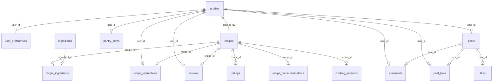

# FlavourFlow Database Schema Guide

This document provides a comprehensive overview of the database schema, table definitions, and relationships in the FlavourFlow application.

---

## 1. Relational ER Diagram

---

## 2. Table Directory & Descriptions

| Table Name | Primary Purpose | Foreign Key Relationships |
| :--- | :--- | :--- |
| **`public.profiles`** | Stores core user accounts (e.g., usernames, display names, avatar URLs). | Links to Supabase Auth metadata. |
| **`public.user_preferences`** | Stores user-selected dietary tags, food allergies, and cuisine preferences. | `user_id` $\rightarrow$ `profiles.id` (1-to-1) |
| **`public.recipes`** | Holds all core recipe data: titles, preparation/cooking times, servings, spice levels, cover images, and step instructions. | `created_by` $\rightarrow$ `profiles.id` (Many-to-1) |
| **`public.ingredients`** | The master ingredient dictionary. Stores English/Urdu translations, ingredient types (solid, liquid, countable, spice), and vector icon URLs. | *Independent reference dictionary* |
| **`public.recipe_ingredients`** | A junction table mapping recipes to specific ingredients, detailing the customized quantity/unit of each ingredient. | `recipe_id` $\rightarrow$ `recipes.id` `ingredient_id` $\rightarrow$ `ingredients.ingredient_id` |
| **`public.pantry_items`** | Keeps track of ingredients users currently have in their physical kitchen inventories/fridges for AI suggestion matching. | `user_id` $\rightarrow$ `profiles.id` (Many-to-1) |
| **`public.reviews`** | Stores text-based reviews left by users on shared recipes. | `user_id` $\rightarrow$ `profiles.id` `recipe_id` $\rightarrow$ `recipes.id` |
| **`public.ratings`** | Stores numeric 1–5 star ratings on recipes. | `recipe_id` $\rightarrow$ `recipes.id` |
| **`public.cooking_sessions`** | Tracks real-time active cooking progress (current step, audio playback states) for hands-free assistance. | `recipe_id` $\rightarrow$ `recipes.id` |
| **`public.recipe_recommendations`**| Cache table for AI-generated recipe suggestions customized to user pantry items. | `recipe_id` $\rightarrow$ `recipes.id` |
| **`public.posts`** | Stores community social dashboard timeline posts (photos, captions). | `user_id` $\rightarrow$ `profiles.id` (Many-to-1) |
| **`public.comments`** | Stores text comments left on community dashboard posts. | `post_id` $\rightarrow$ `posts.id` `user_id` $\rightarrow$ `profiles.id` |
| **`public.post_likes`** / **`likes`** | Tracks likes on social community posts. | `post_id` $\rightarrow$ `posts.id` `user_id` $\rightarrow$ `profiles.id` |
| **`public.recipe_interactions`**| Tracks user actions on recipes (bookmarks, favorites, sharing flags). | `user_id` $\rightarrow$ `profiles.id` `recipe_id` $\rightarrow$ `recipes.id` |
| **`public.cuisine_items`** | Global seed table listing all supported cuisine tags (Pakistani, Indian, Italian, etc.). | *Independent lookup reference* |
| **`public.application_settings`**| Saves per-user app preferences like theme modes (dark/light), selected locale language (EN/UR), and notifications. | `user_id` $\rightarrow$ `profiles.id` |
| **`public.appliances`** | The master appliances/utensils dictionary. Stores tool names, Urdu translations, and icon URLs. | *Independent reference dictionary* |

---

## 3. Core Tables Reference Schemas

### `public.ingredients`
Stores the predefined master list of system ingredients.
* `ingredient_id` (int8, PK): Unique identification key.
* `name` (text): Primary English name (e.g. `"Carrot"`).
* `name_urdu` (text): Urdu translation string (e.g. `"گاجر"`).
* `category` (text): Classification matching allowed units (`solid`, `liquid`, `spice`, `countable`).
* `icon_url` (text): URL pointer pointing to the image bucket/assets storage directory.

### `public.recipes`
Stores standard metadata for published recipes.
* `id` (uuid, PK): Unique identification code.
* `title` (text): Recipe title.
* `description` (text): Paragraph description.
* `ingredients` (jsonb): Frontend-serialized list fallback storage of ingredient names and quantities.
* `steps` (jsonb): JSON list storing instruction text sequences.
* `image_url` (text): Main preview thumbnail URL.
* `images` (array of text): Secondary imagery URLs.
* `prep_time` (int4): Time to prepare in minutes.
* `cook_time` (int4): Time to cook in minutes.
* `servings` (int4): Target servings count.
* `difficulty` (text): Standard difficulty level (`Easy`, `Medium`, `Hard`).
* `cuisine_type` (text): Cuisine categorization tag (e.g., `Pakistani`).
* `dish_category` (text): Meal category tag (e.g., `Dessert`).
* `diet_tags` (array of text): Dietary labels (e.g. `Vegetarian`, `Keto`).
* `spice_level` (int4): Numeric indicator range (1-5).
* `created_by` (uuid, FK): User reference link.
* `appliances` (array of text): Names of kitchen appliances and tools needed.

### `public.appliances`
Stores the predefined master list of system kitchen appliances and utensils.
* `id` (int8, PK): Unique identification key.
* `name` (text): Primary English name (e.g. `"Oven"`).
* `name_urdu` (text): Urdu translation string (e.g. `"اوون"`).
* `icon_url` (text): URL pointing to the icon image asset.
